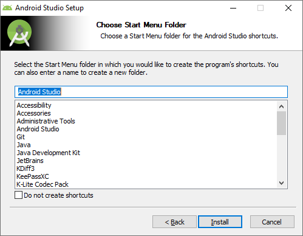
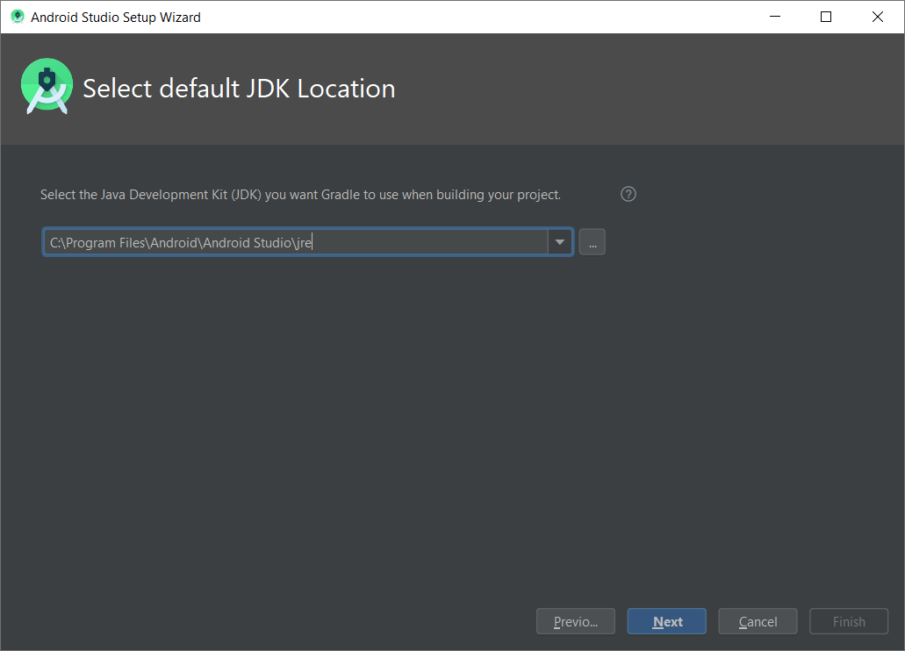
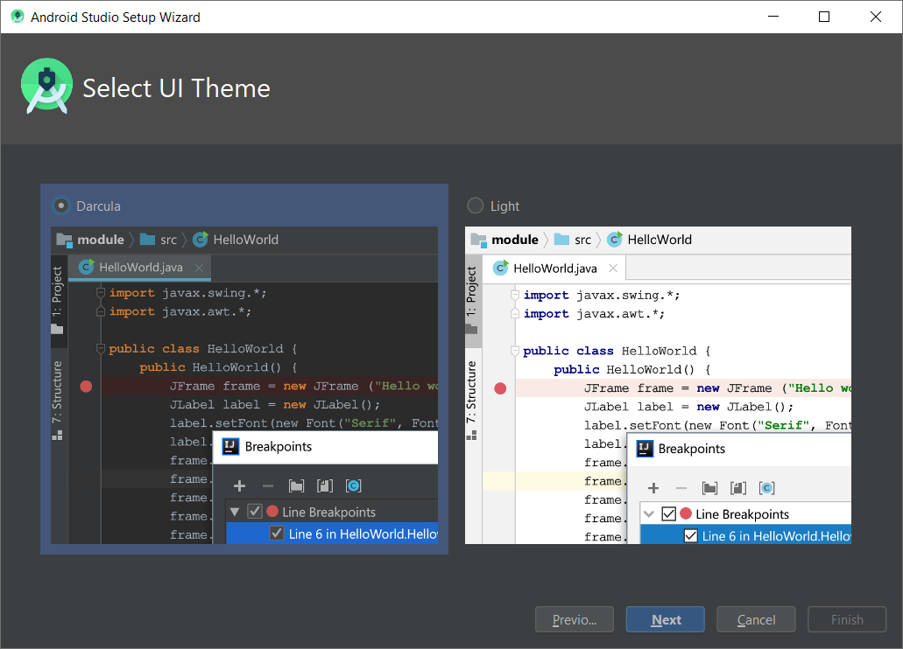

# THEO Knowledge Base - Android Studio Setup

This guide is going to show how to install and configure Android Studio on Windows 10 using `*.exe`
installer. For information about other ecosystems please visit [Download Android Studio] and
[Install Android Studio] pages.

At the time of this guide writing, the latest version of Android Studio is **3.6.1** and this guide
is written based on this version.

## Table of Contents

  * [System requirements]
  * [Installing Android Studio]
  * [Configuring Android Studio]
  * [Summary]

## System requirements

  * Microsoft® Windows® 10 (32- or 64-bit) - The Android Emulator only supports 64-bit Windows
  * 4 GB RAM minimum, 8 GB RAM recommended
  * 2 GB of available disk space minimum, 4 GB Recommended
  * 1280 x 800 minimum screen resolution

For information about system requirements for other ecosystems please check [Download Android Studio]
page.

## Installing Android Studio

Go to [Download Android Studio] page and download proposed installer:

Double-click on downloaded `*.exe` file to launch it. On "Welcome to Android Studio Setup" screen
click **Next >** button:

On "Choose Components" screen select **Android Virtual Device** checkbox and click **Next >** button:

On "Configuration Settings" screen choose Android Studio installation location (or leave default
location proposed by installer). After that click **Next >** button:

On "Choose Start Menu Folder" screen decide whether to create shortcut in Start Menu with chosen
name or leave default settings. Click **Install** button:

Once installation is finished, click **Next >** button on "Installation Complete" screen:

On the last "Completing Android Studio Setup" screen uncheck **Start Android Studio** if Android Studio
should not open immediately after closing installed. Please click **Finish** button:

## Configuring Android Studio

On first time launch, Android Studio presents a dialog box that offers the option of importing
settings from a previous installation. To start with clear Android Studio setup please select
**Do not import settings** option and click **OK** button:

Once Android Studio finishes finding available SDK components, Android Studio Setup Wizard "Welcome"
screen is shown. Click **Next** button:

On "Install Type" screen please select **Custom** installation and proceed by clicking **Next** button:

After that on "Select default JDK location" screen leave default settings and click **Next**:

On the next "Select UI Theme" screen please select preferred Android Studio look&feel and click
**Next** button:

After that on "SDK Components Setup" screen please select:

  * **Android SDK**
  * **Android SDK Platform / API 29: Android 10.0 (Q)**
  * **Performance (Intel ® HAXM)**
  * **Android Virtual Device**

If the checkboxes are grayed out, installation of these components is possible by using SDK Manager
(_Tools > SDK Manager_) available in Android Studio. Additionally, it is possible to specify
Android SDK location or stick to default proposal. Click **Next** button:

On the "Emulator Settings" screen leave default settings and click **Next**:

At this stage of installation, all selected settings are shown and can be verified. Proceed by
clicking **Finish** to apply configuration:

Android Studio Setup Wizard will download and install needed packages. Once it finishes, installation
results will be displayed. At this point simply click **Finish** and start using Android Studio:

## Summary

This guide showed how to successfully install and configure Android Studio. For information about
creating simple Android application from scratch feel free to check
[THEO Knowledge Base - Simple Android Application] guide.

For more guides about THEOplayer please visit [THEO Docs] portal.

[//]: # (Sections reference)
[System requirements]: #system-requirements
[Installing Android Studio]: #installing-android-studio
[Configuring Android Studio]: #configuring-android-studio
[Summary]: #summary

[//]: # (Links and Guides reference)
[THEO Docs]: https://docs.portal.theoplayer.com/
[THEO Knowledge Base - Simple Android Application]: ../knowledgebase-simple-application/README.md
[Download Android Studio]: https://developer.android.com/studio/index.html
[Install Android Studio]: https://developer.android.com/studio/install
