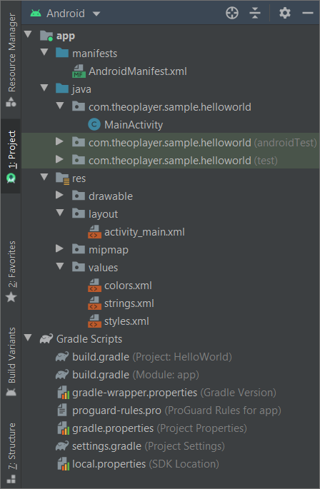

# THEO Knowledge Base - Simple Android Application

This guide will demonstrate how to create simple Android application.

For details on how to install Android Studio, feel free to check
[THEO Knowledge Base - Android Studio Setup] guide.


## Table of Contents

  * [Create New Project]
  * [Explaining Project Structure]
  * [Splash Screen and Action Bar]
  * [Summary]


## Create New Project

Start with opening Android Studio. To begin, choose the **Start a new Android Studio project** option:


An `Activity` is a screen of the application, it provides the window in which the app draws its UI.
On the "Select a Project Template" screen go to **Phone and Tablet** tab and select **Empty Activity**
project. Click **Next** button.


At this point Android Studio will prompt to configure few basic parameters of the application.
For purposes of this guide the project will be configured as follows:

  * _Name_: **HelloWorld**
  * _Package name_: **com.theoplayer.sample.helloworld**
  * _Save location_: filled automatically while entering _Name_
  * _Language_: **Java**
  * _Minimum SDK_: **API 16: Android 4.1 (Jelly Bean)**

Although, any _Minimum SDK_ selection is possible, please note that **API 16: Android 4.1 (Jelly Bean)**
is the minimum API level supported by THEOplayer SDK.


After clicking **Finish** Android Studio will start to prepare the project. It will take a while
because Android Studio is downloading the dependencies, project requirements and is indexing files.
Indexing progress is displayed at the bottom of the window. Once indexing is done, environment is
ready to work with new application.


## Explaining Project Structure

By default, Android Studio displays project files in the **Android** view. This view does not
reflect the actual file hierarchy on disk, but is organized by modules and file types to simplify
navigation between key source files, hiding certain files or directories that are not commonly used.



  * `manifests` - Contains the `AndroidManifest.xml` file, see the [App Manifest Overview] for more details.
  * `java` - Contains the Java source code files, separated by package names, including JUnit test code.
  * `res` - Contains all non-code resources, such as XML layouts, UI strings, and bitmap images,
    divided into corresponding sub-directories. For more information about all possible resource
    types, see the [App Resources Overview].
  * `Gradle Scripts` - Shows all the project's build-related configuration files.

To see the actual file structure of the project including all hidden files please select **Project**
view from the **Android** dropdown list at the top left corner of the Android Studio window:


When **Project** view is selected, a lot more files and directories are shown:


The most important of which are the following:

  * `app/` - Contains all module files:
    * `build/` - Contains build outputs.
    * `libs/` - Contains private libraries.
    * `src/` - Contains all code and resource files for the module in the following subdirectories:
      * `src/androidTest/` - Contains code for instrumentation tests that run on an Android device.
        For more information, see the [Test Your App] guide.
      * `src/main/` - Contains the "main" sources files: Android code and resources shared by all
        build variants.
      * `src/main/java/` - Contains Java code sources.
      * `src/main/res/` - Contains application resources, such as drawable files, layout files,
        and UI string. See [App Resources Overview] for more details.
      * `src/main/AndroidManifest.xml` - Describes the nature of the application and each of its
        components. For more information, see the [App Manifest Overview].
      * `src/test/` - Contains code for unit tests.
    * `build.gradle` (app-level) - Defines the application specific build configurations.
  * `build.gradle` (project-level) - Defines the build configuration that applies to all modules.

For more information about creating Android application please check [Write Your App] guide.


## Splash Screen and Action Bar

Steps below are **optional**. They are not required to have working application, but it's worth
to have them applied.

It's extremely useful to define even very simple splash screen to not display white screen while
application is loading. To do that, displayed by default [Action Bar] needs to be hidden. This can be
done by adding following `AppTheme.NoActionBar` theme definition in `src/main/res/values/styles.xml`
file:

```xml
<style name="AppTheme.NoActionBar" parent="AppTheme">
    <item name="windowActionBar">false</item>
    <item name="windowNoTitle">true</item>
</style>
```

As a next step, apply that theme in `src/main/java/com/theoplayer/sample/MainActivity.java` class
in `onCreate` method. Note that theme needs to be set before `super.onCreate(...)` call:

```java
public class MainActivity extends AppCompatActivity {

    @Override
    protected void onCreate(Bundle savedInstanceState) {
        setTheme(R.style.AppTheme_NoActionBar);
        super.onCreate(savedInstanceState);
        // ...
    }
}
```

To set very simple splash screen, please open again `src/main/res/values/styles.xml` and add
`AppTheme.Launcher` theme definition:

```xml
<style name="AppTheme.Launcher" parent="AppTheme.NoActionBar">
    <item name="android:windowBackground">@color/colorPrimaryDark</item>
</style>
```

After that, apply that theme in `src/main/AndroidManifest.xml` file by adding `android:theme`
attribute to `<activity>` tag:

```xml
<activity
    android:name=".MainActivity"
    android:theme="@style/AppTheme.Launcher">
    <!-- ... -->
</activity>
```


## Summary

This guide covered the way of creating simple Android application. For more information about
launching Android application feel free to check [THEO Knowledge Base - Virtual and Physical Devices]
guide.

For more guides about THEOplayer please visit [THEO Docs] portal.


[//]: # (Sections reference)
[Create New Project]: #create-new-project
[Explaining Project Structure]: #explaining-project-structure
[Splash Screen and Action Bar]: #splash-screen-and-action-bar
[Summary]: #summary

[//]: # (Links and Guides reference)
[THEO Docs]: https://docs.portal.theoplayer.com/
[THEO Knowledge Base - Android Studio Setup]: ../knowledgebase-android-studio-setup/README.md
[THEO Knowledge Base - Virtual and Physical Devices]: ../knowledgebase-virtual-and-physical-devices/README.md
[App Manifest Overview]: https://developer.android.com/guide/topics/manifest/manifest-intro.html
[App Resources Overview]: https://developer.android.com/guide/topics/resources/providing-resources.html
[Test Your App]: https://developer.android.com/studio/test
[Write Your App]: https://developer.android.com/studio/write
[Action Bar]: https://developer.android.com/training/appbar
