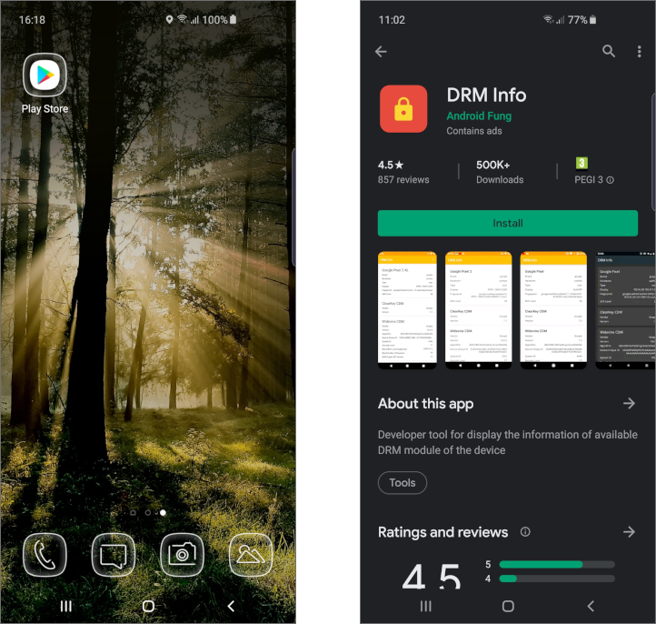
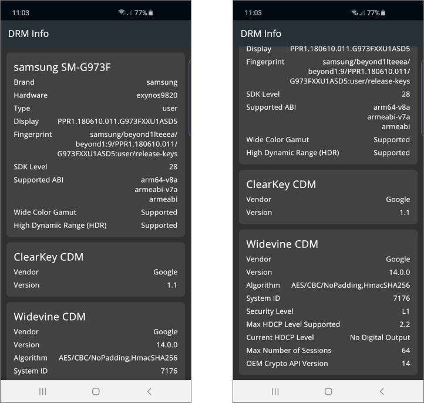

# THEOplayer How To's - Inspecting DRM Capabilities

This guide is going to show how to examine physical Android device DRM capabilities.

For more information about DRM systems or about their capabilities limitations please check
[THEO Knowledge Base - DRM Systems] and [THEO Knowledge Base - DRM Capabilities Limitations] guides.

## Table of Contents

  * [Can Device Stream HD Content?]
  * [Installing DRM Info App]
  * [Using DRM Info App]
  * [Summary]

## Can Device Stream HD Content?

Unfortunately, there's no easy way to get know if the device allows streaming HD content before
buying it. There is no information about DRM conformity on most specification sheets. Most of
the Android devices, especially the top ones, allow for HD streaming content protected
by Widevine DRM, but not all of them.

Luckily, device DRM capabilities is something that can be checked easily. There's a free,
ad-supported app for that, available to download in Play Store: [DRM Info].

**DRM Info** displays the information about the DRM modules of the device. Following DRM modules
are supported:

  * CENC ClearKey
  * Adobe Primetime
  * Google Widevine Modular DRM
  * Marlin
  * Microsoft PlayReady
  * Verimatrix

## Installing DRM Info App

Open **Play Store** application on the mobile device. Search for **DRM Info** app and click **Install**:

## Using DRM Info App

Once opened, **DRM Info** will show information only about Content Decryption Modules (CDMs)
supported by the device. The other (verified by **DRM Info**) won't be visible if device does not
support them.

To check if Android device can stream HD content please scroll down to **Widevine CDM** section
and search for **Security Level** item. It should have **L1** value. If not, then it means that
the device is not capable of displaying HD content.

## Summary

This guide showed how to inspect DRM capabilities on the Android device.

For more guides about THEOplayer please visit [THEO Docs] portal.

[//]: # (Sections reference)
[Can Device Stream HD Content?]: #can-device-stream-hd-content
[Installing DRM Info App]: #installing-drm-info-app
[Using DRM Info App]: #using-drm-info-app
[Summary]: #summary

[//]: # (Links and Guides reference)
[THEO Docs]: https://docs.portal.theoplayer.com/
[THEO Knowledge Base - DRM Systems]: https://docs.portal.theoplayer.com/docs/docs/advanced-topics/content-protection/content-protection-1-digital-rights-management-drm-systems
[THEO Knowledge Base - DRM Capabilities Limitations]: ../knowledgebase-drm-capabilities-limitations/README.md
[DRM Info]: https://play.google.com/store/apps/details?id=com.androidfung.drminfo
