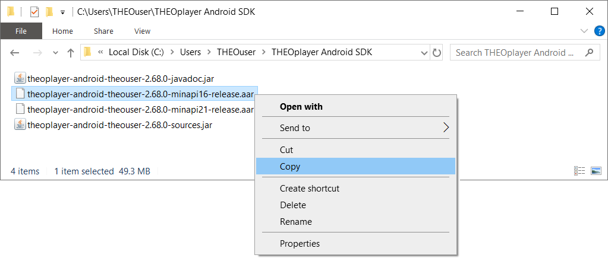
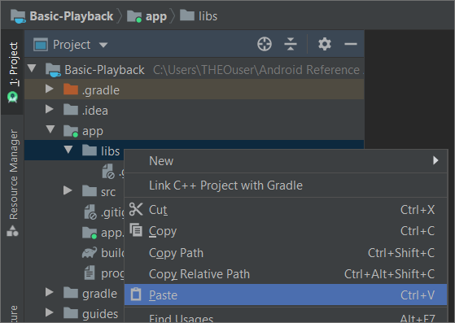
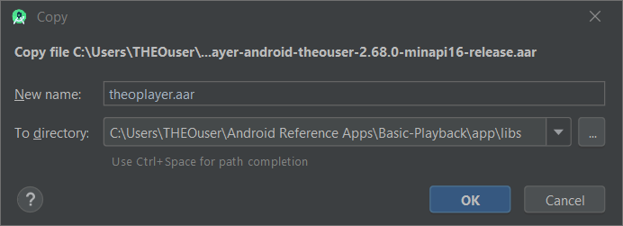
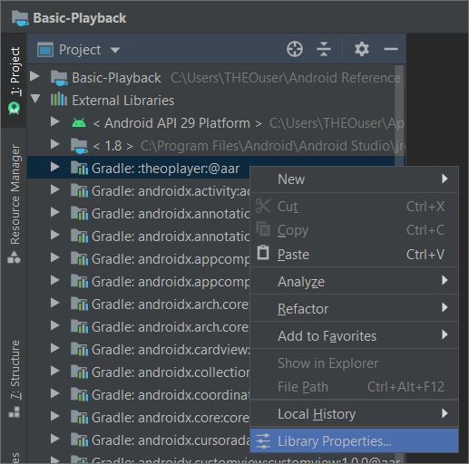
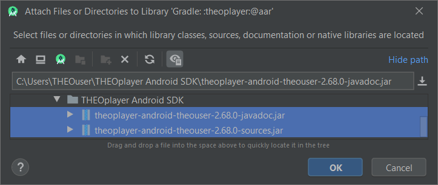
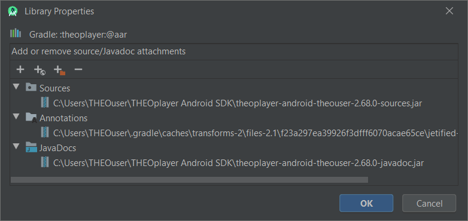

# THEOplayer How To's - THEOplayer Android SDK Integration

This guide covers steps needed to integrate **THEOplayer Android SDK** with the Android application.

To obtain THEOplayer Android SDK please visit [Get Started with THEOplayer].

Presented code snippets are taken from [THEO Basic Playback] reference app. Please note that in this
app all URLs are defined as an Android resource, but they can be inlined as well. Please check
[values.xml] file for URLs definition.


## Table of Contents

  * [Unzipping THEOplayer SDK]
  * [Including THEOplayer SDK]
  * [Importing JavaDocs and Sources]
  * [Attaching THEOplayer View]
  * [Configuring Sample Stream]
  * [Summary]


## Unzipping THEOplayer SDK

THEOplayer Android SDK zip package contains the following files:

  * _theoplayer-android-\[name\]-\[version\]-**minapi21**-release.aar_
    * Contains THEOplayer SDK for all Android devices starting with Android 5.0 (Lollipop).
  * _theoplayer-android-\[name\]-\[version\]-**minapi16**-release.aar_
    * Contains THEOplayer SDK for all Android devices starting with Android 4.1 (Jelly Bean).
  * _theoplayer-android-\[name\]-\[version\]-**javadoc**.jar_
    * Contains THEOplayer SDK API documentation.
  * _theoplayer-android-\[name\]-\[version\]-**sources**.aar_
    * Contains source code of the exposed THEOplayer SDK API.

What the file extensions mean?

  * **JAR** (Java Archive) - is a package file format typically used to aggregate many Java class
    files and associated metadata and resources into one file for distribution.
  * **AAR** (Android Archive) - unlike JAR files, can contain Android resources and a manifest file,
    which allows to bundle in shared resources like layouts and drawables in addition to Java
    classes and methods. Usually Android Library projects are compiled to AAR file for distribution.
  * **APK** (Android Package) - is a package file format used by the Android operating system for
    distribution and installation of mobile apps. The application containing THEOplayer will
    compile to an APK file.

With the `minApi16` version, the largest possible amount of devices can be supported. However,
this version is about `50MB` while the `minApi21` version is less than `2MB`. For that reason,
it is useful to use both in a way that users who have Android 5.0 or higher will have a much
smaller APK file. For information about build variants and configuring flavors please check
[Configure Product Flavors] guide.

For purposes of this guide we will be focusing on the `minApi16` version, but for the `minApi21`
version steps are the same.


## Including THEOplayer SDK

Find obtained THEOplayer Android SDK files on the hard drive and right click on
**`theoplayer-android-[name]-[version]-minapi16-release.aar`** file to choose **Copy** option:



Right click on **[libs]** folder to choose **Paste** option:



[THEO Basic Playback] application is using `theoplayer.aar` file name for THEOplayer Android SDK,
so for purposes of this guide let's rename library file name to **`theoplayer.aar`** while pasting:



Next step is to modify the `build.gradle` files to load `theoplayer.aar` library. In
**[project-level build.gradle]** file define **`flatDir`** repository as shown below. This will
allow loading AAR files from the [libs] folder as a regular dependencies:

```groovy
allprojects {
    repositories {
        // ...

        // Attaching project 'libs' folder as a flatRepo allows importing library
        // as a regular artifact, not as a file.
        flatDir {
            dirs 'libs'
        }
    }
}
```

In the **[app-level build.gradle]** file in **`dependencies`** section please define THEOplayer SDK
dependency. THEOplayer SDK requires to have [Gson] library from Google added as dependency.
It is used to convert Java object to and from JSON representation:

```groovy
dependencies {
    // ...

    // THEOplayer required dependencies.
    implementation ':theoplayer@aar'
    implementation 'com.google.code.gson:gson:2.8.5'

    // ...
}
```

Every time change in Gradle files are made, Android Studio will ask to sync them. This can be done
by pressing the **Sync Now** link on the top right corner (this can be also executed from
**File > Sync Project with Gradle Files** menu item):


## Importing JavaDocs and Sources

Optionally, one can import sources and javadoc jars for included THEOplayer Android SDK. Although,
this step is not mandatory, it brings additional value such as ability to see the API java source
files with their documentation in Android Studio.

Expand **External Libraries** item in project view, then right click on **`Gradle: :theoplayer:@aar`**
library and select **Library Properties...** option:



Click on **"Plus"** icon at top left corner:


Find obtained THEOplayer Android SDK files and select both **`theoplayer-android-[name]-[version]-javadoc.jar`**
and **`theoplayer-android-[name]-[version]-sources.jar`**. Click **OK** button:



Once properties are added click **OK**:




## Attaching THEOplayer View

To be able to play online videos with THEOplayer add **[INTERNET permission]** into
the **[AndroidManifest.xml]** file:

```xml
<manifest xmlns:android="http://schemas.android.com/apk/res/android"
    package="com.theoplayer.sample.playback.basic">

    <!-- In order to play online streams or ads it is needed to add permissions below -->
    <uses-permission android:name="android.permission.INTERNET" />

    <!-- ... -->

</manifest>
```

Next, add the **`THEOplayerView`** to the main activity layout **[activity_player.xml]**.

```xml
<androidx.coordinatorlayout.widget.CoordinatorLayout
    android:layout_width="match_parent"
    android:layout_height="match_parent">

    <!-- ... -->

    <com.theoplayer.android.api.THEOplayerView
        android:id="@+id/theoPlayerView"
        android:layout_width="match_parent"
        android:layout_height="match_parent"
        app:layout_behavior="@string/appbar_scrolling_view_behavior" />

</androidx.coordinatorlayout.widget.CoordinatorLayout>
```

[CoordinatorLayout] is used to include [AppBarLayout]. `app:layout_behavior` attribute is added to
`THEOplayerView` to display app correctly. This additional attribute won't be needed if other layouts
are used. For more information please check [Material Design - App Bars] and
[Material Design - Collapsing Toolbars] guides.

In the main activity [PlayerActivity.java], maintain a reference to the `THEOplayerView` and
`Player` objects based on the `id` defined in previous step:

```java
public class PlayerActivity extends AppCompatActivity {

    private ActivityPlayerBinding viewBinding;
    private Player theoPlayer;

    @Override
    protected void onCreate(Bundle savedInstanceState) {
        // ...

        // Inflating view and obtaining an instance of the binding class.
        viewBinding = DataBindingUtil.setContentView(this, R.layout.activity_player);

        // Gathering THEO objects references.
        theoPlayer = viewBinding.theoPlayerView.getPlayer();

        // ...
    }
}
```

Here [Data Binding Library] is used. It allows to bind [activity_player.xml] layout to the autogenerated
object `ActivityPlayerBinding` and remove UI framework calls like for example `findViewById(R.id.theoPlayerView)`,
making them simpler and easier to maintain. This can also improve application performance and help
prevent memory leaks and null pointer exceptions. In order to use [Data Binding Library] please add
**`dataBinding.enabled = true`** parameter in **[app-level build.gradle]**. `THEOplayerView` reference
can be still obtained by calling `THEOplayerView theoPlayerView = findViewById(R.id.theoPlayerView);`
without a need of having data binding enabled.

In order to work properly and in sync with the [Activity Lifecycle] changes (e.g. when device is
rotated, new activity is started or app is moved to background), THEOplayer needs to react accordingly.
The **`onResume`**, **`onPause`** and **`onDestroy`** methods of the **`THEOplayerView`** needs
to be called together with matching activity methods:

```java
public class PlayerActivity extends AppCompatActivity {

    // ...

    // In order to work properly and in sync with the activity lifecycle changes (e.g. device
    // is rotated, new activity is started or app is moved to background) we need to call
    // the "onResume", "onPause" and "onDestroy" methods of the THEOplayerView when the matching
    // activity methods are called.

    @Override
    protected void onPause() {
        super.onPause();
        viewBinding.theoPlayerView.onPause();
    }

    @Override
    protected void onResume() {
        super.onResume();
        viewBinding.theoPlayerView.onResume();
    }

    @Override
    protected void onDestroy() {
        super.onDestroy();
        viewBinding.theoPlayerView.onDestroy();
    }
}
```


## Configuring Sample Stream

Firstly, create a **`TypedSource.Buidler`** that allows to define the type and location of a single
stream source. Example below shows `TypeSource` definition for sample stream:

```java
public class PlayerActivity extends AppCompatActivity {

    @Override
    protected void onCreate(Bundle savedInstanceState) {
        // ...

        // Configuring THEOplayer playback with default parameters.
        configureTHEOplayer();
    }

    private void configureTHEOplayer() {
        //...

        // Creating a TypedSource builder that defines the location of a single stream source.
        TypedSource.Builder typedSource = TypedSource.Builder
                .typedSource(getString(R.string.defaultSourceUrl));

        // ...
    }
}
```

Secondly, build `TypedSource` object and create a **`SourceDescription.Builder`**  that allows to
define settings to be applied for a new stream source. It is not required to define poster URL as
in example, but it's "nice to have" for better user experience:

```java
public class PlayerActivity extends AppCompatActivity {

    // ...

    private void configureTHEOplayer() {
        // ...

        // Creating a SourceDescription builder that contains the settings to be applied as a new
        // THEOplayer source.
        SourceDescription.Builder sourceDescription = SourceDescription.Builder
                .sourceDescription(typedSource.build())
                .poster(getString(R.string.defaultPosterUrl));

        // ...
    }
}
```

Lastly, build **`SourceDescription`** object and configure THEOplayer with it:

```java
public class PlayerActivity extends AppCompatActivity {

    // ...

    private void configureTHEOplayer() {
        // ...

        // Configuring THEOplayer with defined SourceDescription object.
        theoPlayer.setSource(sourceDescription.build());

        // ...
    }
}
```

Optionally, specify few event listeners to get a better view of actual THEOplayer state:

```java
public class PlayerActivity extends AppCompatActivity {

    private static final String TAG = PlayerActivity.class.getSimpleName();

    // ...

    private void configureTHEOplayer() {
        // ...

        // Adding listeners to THEOplayer basic playback events.
        theoPlayer.addEventListener(PlayerEventTypes.PLAY, event -> Log.i(TAG, "Event: PLAY"));
        theoPlayer.addEventListener(PlayerEventTypes.PLAYING, event -> Log.i(TAG, "Event: PLAYING"));
        theoPlayer.addEventListener(PlayerEventTypes.PAUSE, event -> Log.i(TAG, "Event: PAUSE"));
        theoPlayer.addEventListener(PlayerEventTypes.ENDED, event -> Log.i(TAG, "Event: ENDED"));
        theoPlayer.addEventListener(PlayerEventTypes.ERROR, event -> Log.i(TAG, "Event: ERROR, error=" + event.getError()));
    }
}
```


## Summary

This guide covered ways of integrating THEOplayer Android SDK and configure stream source URL for
basic playback.

For more guides about THEOplayer SDK API usage and tips&tricks please visit [THEO Docs] portal.


[//]: # (Sections reference)
[Unzipping THEOplayer SDK]: #unzipping-theoplayer-sdk
[Including THEOplayer SDK]: #including-theoplayer-sdk
[Importing JavaDocs and Sources]: #importing-javadocs-and-sources
[Attaching THEOplayer View]: #attaching-theoplayer-view
[Configuring Sample Stream]: #configuring-sample-stream
[Summary]: #summary

[//]: # (Links and Guides reference)
[THEO Basic Playback]: ../..
[THEO Docs]: https://docs.portal.theoplayer.com/
[Get Started with THEOplayer]: https://www.theoplayer.com/licensing
[Material Design - App Bars]: https://material.io/components/app-bars-top/#
[Material Design - Collapsing Toolbars]: https://material.io/develop/android/components/collapsing-toolbar-layout/
[Configure Product Flavors]: https://developer.android.com/studio/build/build-variants#product-flavors
[Data Binding Library]: https://developer.android.com/topic/libraries/data-binding
[INTERNET permission]: https://developer.android.com/reference/android/Manifest.permission.html#INTERNET
[Activity Lifecycle]: https://developer.android.com/guide/components/activities/activity-lifecycle
[CoordinatorLayout]: https://developer.android.com/reference/androidx/coordinatorlayout/widget/CoordinatorLayout
[AppBarLayout]: https://developer.android.com/reference/com/google/android/material/appbar/AppBarLayout
[Gson]: https://github.com/google/gson

[//]: # (Project files reference)
[libs]: ../../app/libs
[app-level build.gradle]: ../../app/build.gradle
[project-level build.gradle]: ../../build.gradle
[AndroidManifest.xml]: ../../app/src/main/AndroidManifest.xml
[activity_player.xml]: ../../app/src/main/res/layout/activity_player.xml
[PlayerActivity.java]: ../../app/src/main/java/com/theoplayer/sample/playback/basic/PlayerActivity.java
[values.xml]: ../../app/src/main/res/values/values.xml
