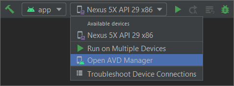
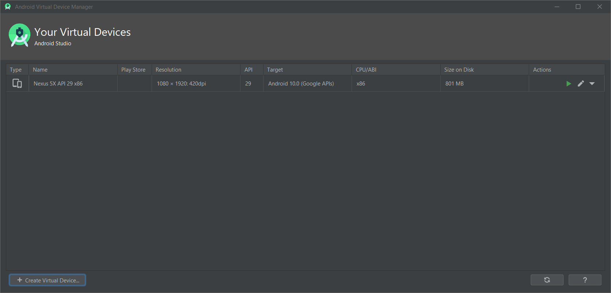
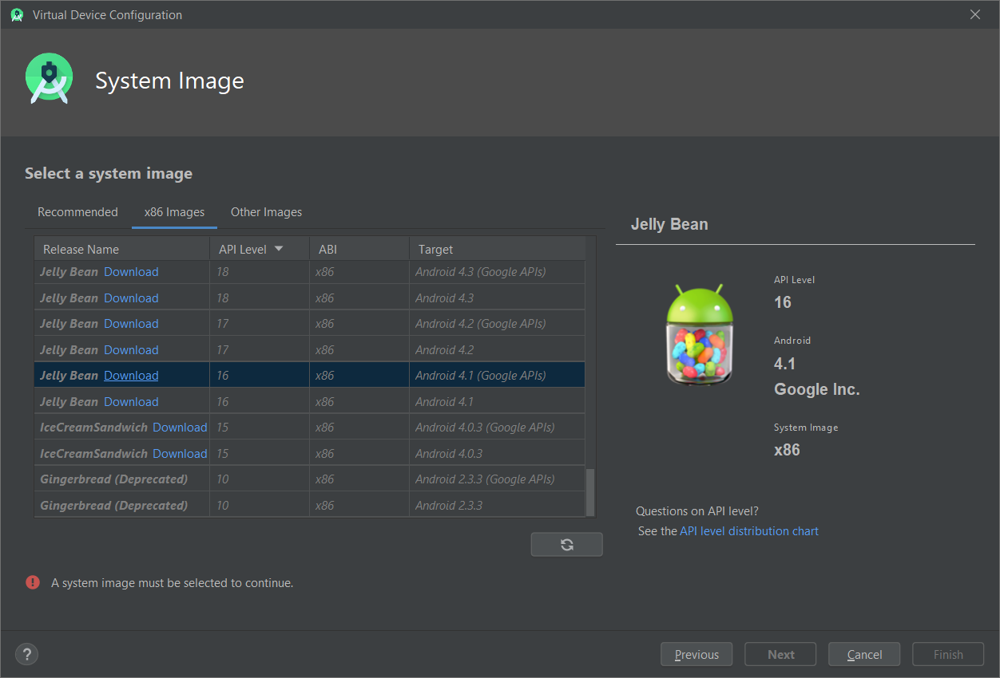
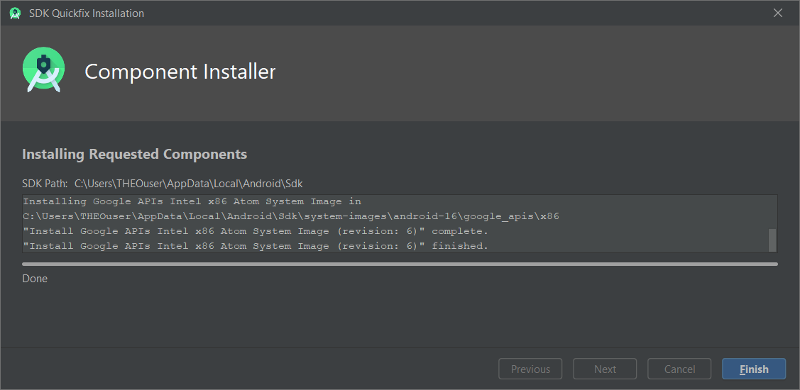
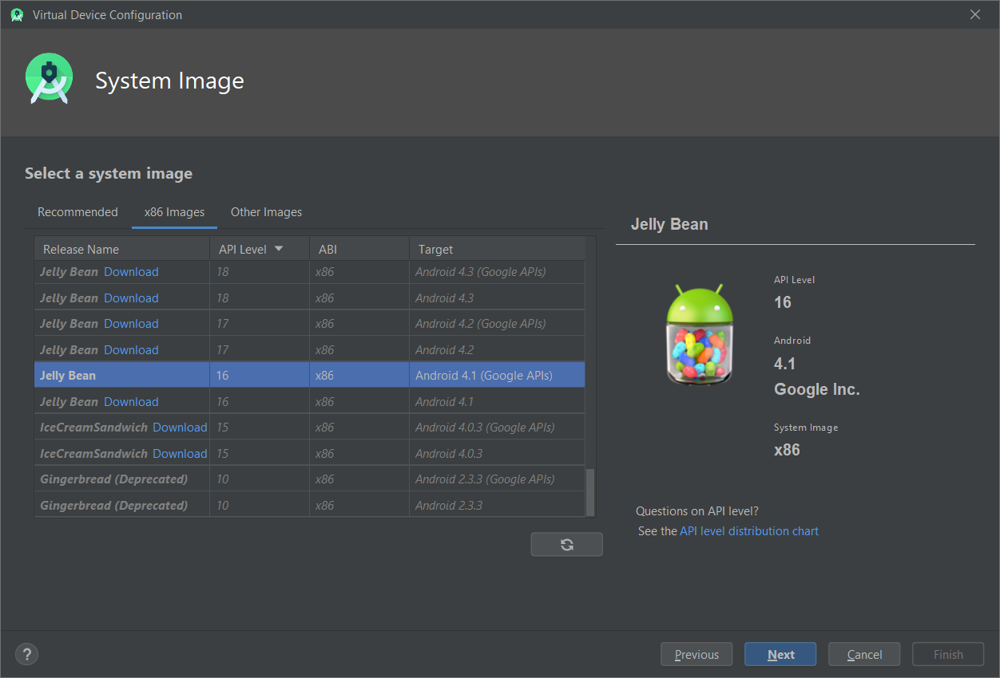
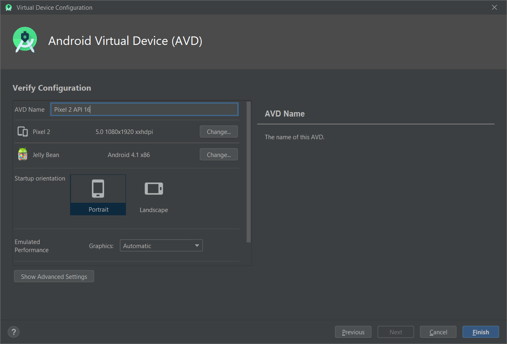
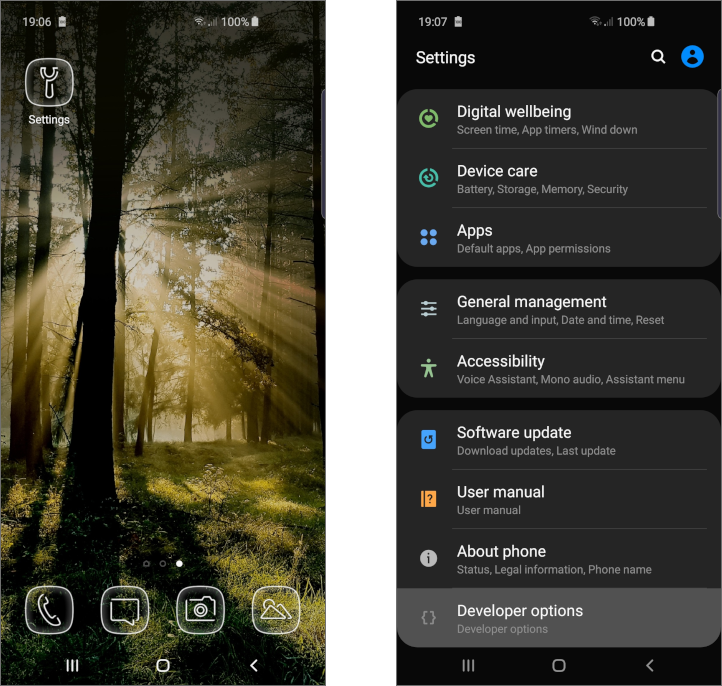
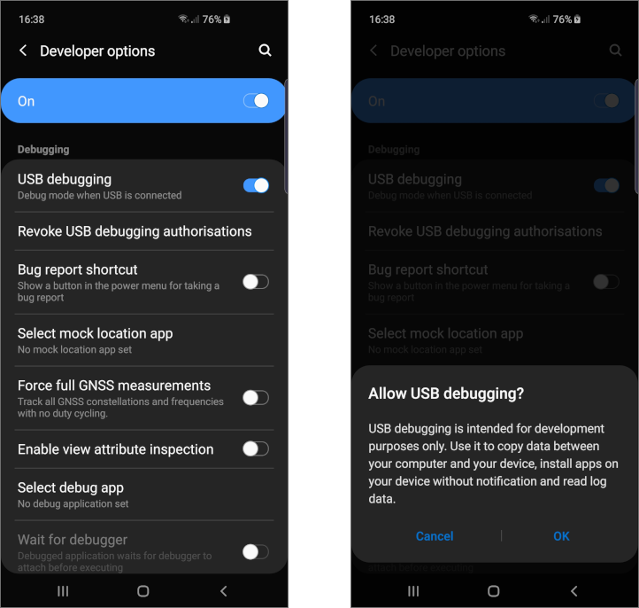
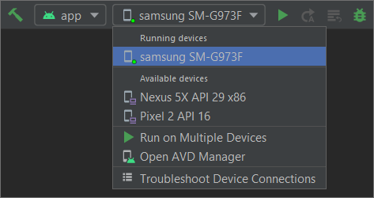

# THEO Knowledge Base - Virtual and Physical Devices

This guide is going to show how to work with virtual and physical Android devices.

For details on how to install Android Studio, feel free to check
[THEO Knowledge Base - Android Studio Setup] guide. Additionally, feel free to check
[THEO Knowledge Base - Simple Android Application] guide for sample application that might be used
for purposes of this guide.

**IMPORTANT NOTE!!! - We strongly encourage testing on physical devices instead of emulator.
Because of emulator limitations THEOplayer might behave unexpectedly.**

## Table of Contents

  * [Building and Running App]
  * [Working with Android Virtual Devices]
    * [Creating New Android Virtual Device]
    * [Emulator Limitations]
  * [Working with Physical Android Devices]
    * [Enable Developer Options]
    * [Set Up a Device for Development]
  * [Summary]

## Building and Running App

Android Studio sets up new projects to deploy to the Android Emulator or a connected device with
just a few clicks.

First of all please select **app** from the run configurations drop-down menu:

From the target device drop-down menu, select the device on which the application will be launched:

Click **Run** ![Run][icon-run]. Once app is installed, it can be reloaded with following options:

  * **Apply Changes and Restart Activity** ![Apply changes and restart][icon-apply-and-restart] -
    Attempts to apply both resource and code changes by restarting activity but without restarting
    app. Generally, this option can be used when code has been modified in the body of a method or
    an existing resource.
  * **Apply Code Changes** ![Apply code changes][icon-apply] - Attempts to apply only code changes
    without restarting anything. Generally, this option can be used when code is modified in the body
    of a method without any resources modifications. If both code and resources have been modified,
    use option above instead.
  * **Run** ![Rerun][icon-rerun] - Deploys all changes and restarts the app. Use this option when
    the changes made cannot be applied using either of the previous options.

## Working with Android Virtual Devices

The Android Emulator simulates Android devices on computer, making it possible to test application
on a variety of devices and Android API levels without needing to have each physical device.

The emulator provides almost all of the capabilities of a real Android device. It can simulate
incoming phone calls and text messages, specify the location of the device, simulate different network
speeds, simulate rotation and other hardware sensors, access the Google Play Store, and much more.

Testing app on the emulator is in some ways faster and easier than doing so on a physical device.
For example, data can be transferred faster to the emulator than to a device connected over USB.

Guide below shows how to create new Android Virtual Device. For more detailed information please
visit [Run apps on the Android Emulator] page.

### Creating New Android Virtual Device

Open the AVD Manager by clicking **Tools > AVD Manager**, or available devices drop-down list:

Click **Create Virtual Device...** at the bottom of the AVD Manager dialog:

On "Select Hardware" screen choose hardware profile describing physical device selected to emulate.
For purposes of this guide **Pixel 2** is selected. After selecting hardware click **Next**:

On "System Image" screen please go to **x86 Images** tab and select Android version that will be
installed and click **Download** if it's not already downloaded. For purposes of this guide
**Jelly Bean - API 16 - Android 4.1 (Google APIs)** is selected:

At this point licence agreement needs to be accepted, by checking **Accept** option at the bottom
and clicking **Next**:

Once selected, system image is downloaded click **Finish**:

Now select downloaded system image and click **Next**:

As a last step virtual device name, screen orientation and few other options can be defined.
After that click **Finish**:

After closing AVD Manager virtual device that has just been created can be selected as a target
device for an application:

### Emulator Limitations

The Android emulator is probably the most powerful tool at a developer's disposal. It is important
to understand it's limitations:

  * Hardware features limitations:
    * No support for IMEI number (00000 is returned) or device ID.
    * No support for Mac Address.
    * No support for real world GPS testing.
    * No support for Camera.
    * No support for Audio playback and recording.
    * No support for Sensors (Acceleration sensor, Gravity sensor, Gyroscope). Sensor events can be
      simulated through the emulator console.
    * No support for placing or receiving actual phone calls. Phone calls can be simulated
      (placed and received) through the emulator console.
    * No support for determining network connected state.
    * No support for determining battery charge level and AC charging state.
    * No support for Bluetooth.
    * No support for USB connections.
    * No support for device-attached headphones.
    * No support for determining SD card insert/eject.
    * No support for hardware DRM
  * Software features limitation:
    * Some of the API's behave differently or don't work at all on the emulator, e.g. Canvas API
      like `clipPath`, `drawPath`, etc. Few of the action bar API's like `setHasOptionsMenu` behave
      differently on devices because of inconsistency of implementation between manufacturers.
    * No support for openGL 2.0 API.
    * Cannot test In-App Billing.
    * No support for multi touch events like pinch to zoom, drag, rotate, etc.
    * PlayStore is not supported on emulator below 4.2.2 so dependent services like Maps,
      Push Notifications don't work.
  * Testing limitations:
    * Exact look and feel because of difference in screen densities which may not map properly
      to the emulator.
    * Application load times, it would be either too slow on a normal emulator and very fast on
      a x86 based emulator.
    * Application performance for reason mentioned above and because of lack of peripherals
      and services that run on an actual device.
    * UI performance (view transitions, orientation changes, scrolling).
    * Browser differences (for web apps).
    * Subtle differences in UI touch events.
    * Battery usage/consumption.

For more detailed information please check answer to
[Why is an actual Android device preferred over an emulator for development purposes?] question,
[Using the Emulator] docs and [Run apps on the Android Emulator] guide.

## Working with Physical Android Devices

When building an Android app,it's important that it has been tested on a real device before
releasing it to users.

Guide below shows how to connect physical Android device. For more detailed information please
visit [Run apps on a hardware device] page.

### Enable Developer Options

Before start, developer option needs to be enabled on selected device. On Android 4.1 and lower,
the Developer options screen is available by default. On Android 4.2 and higher, screen can
be enabled as follows:

  1. Open the **Settings** app.
  2. (Only on Android 8.0 or higher) Select **System**.
  3. Scroll to the bottom and select **About phone**.
  4. Scroll to the bottom and tap **Build number** 7 times.
  5. Return to the previous screen to find **Developer options** near the bottom.

### Set Up a Device for Development

Before debugging on device will be possible, there are a few things to do. Please note that
screens below are only illustrative. On different mobiles it can look a bit different,
but the option names are the same.

Open **Settings** app on the device and scroll down to **Developer options**. Select them:

Scroll down to find **USB debugging** option and enable it. If the device ask for confirmation
then confirm that action:

Connect device with PC via USB cable. Please check first that USB cable is not damaged. Faulty USB
cable can cause issues while connecting physical device to the PC. We strongly encourage using USB
cable provided by device manufacturer.

If the device asks about allowing USB device from connected PC then confirm:

From now on connected device can be selected a target device for an application:

## Summary

This guide showed how to launch application on physical and virtual devices and what are
the emulator limitations. Please remember that it is strongly recommended to test apps with
THEOplayer on physical devices.

For more guides about THEOplayer please visit [THEO Docs] portal.

[//]: # (Sections reference)
[Building and Running App]: #building-and-running-app
[Working with Android Virtual Devices]: #working-with-android-virtual-devices
[Creating New Android Virtual Device]: #creating-new-android-virtual-device
[Emulator Limitations]: #emulator-limitations
[Working with Physical Android Devices]: #working-with-physical-android-devices
[Enable Developer Options]: #enable-developer-options
[Set Up a Device for Development]: #set-up-a-device-for-development
[Summary]: #summary

[//]: # (Links and Guides reference)
[THEO Docs]: https://docs.portal.theoplayer.com/
[THEO Knowledge Base - Android Studio Setup]: ../knowledgebase-android-studio-setup/README.md
[THEO Knowledge Base - Simple Android Application]: ../knowledgebase-simple-application/README.md
[Run apps on the Android Emulator]: https://developer.android.com/studio/run/emulator
[Run apps on a hardware device]: https://developer.android.com/studio/run/device
[Why is an actual Android device preferred over an emulator for development purposes?]: https://www.quora.com/Why-is-an-actual-Android-device-preferred-over-an-emulator-for-development-purposes
[Using the Emulator]: http://www.androiddocs.com/tools/devices/emulator.html

[//]: # (Project files reference)
[icon-run]: images/icon-run.png "Run"
[icon-rerun]: images/icon-rerun.png "Rerun"
[icon-apply-and-restart]: images/icon-apply-and-restart.png "Apply changes and restart"
[icon-apply]: images/icon-apply.png "Apply code changes"
