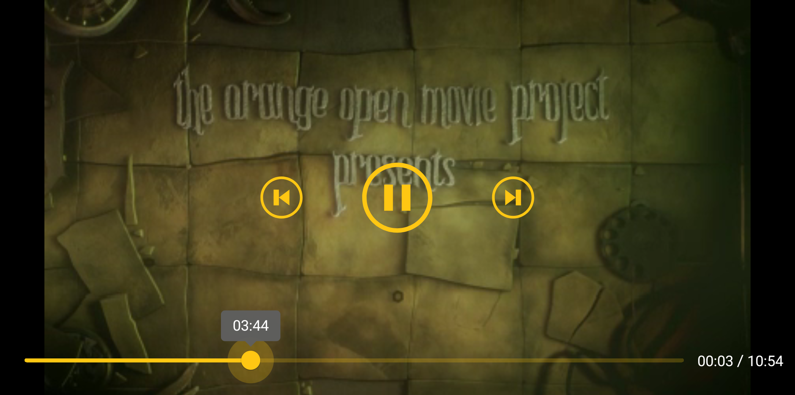

# THEOplayer How To's - Defining Custom Player Controls

This guide is going to demonstrate how THEOplayer can be setup and configured to be controlled by
a custom native UI. It will show how to disable default THEOplayer UI and how to use THEOplayer SDK
API to control the stream. We will also briefly describe various types of controls used in presented
player custom UI.

To obtain THEOplayer Android SDK please visit [Get Started with THEOplayer].

Presented code snippets are taken from [THEO Custom UI] reference app. Please note that in
this app all URLs are defined as an Android resource, but they can be inlined as well. Please check
[values.xml] file for URLs definition.


## Table of Contents

  * [Custom UI Layout Overview]
  * [Disabling Default UI]
  * [Loading Spinner]
  * [Play/Pause Button]
  * [Time Label]
  * [Progress Bar]
  * [Skip Forward or Backward]
  * [Full Screen Mode]
  * [Summary]


## Custom UI Layout Overview

In this section we will briefly describe the layout of presented Custom UI to have general overview
how it is composed and managed.

Please check the layout skeleton below, showing the most important objects for our custom UI,
the full layout definition can be found in [activity_player.xml] file:

```xml
<layout>

    <data><!-- Bingind PlayerViewModel --></data>

    <FrameLayout>

        <THEOplayerView android:id="@+id/theoPlayerView" />

        <FrameLayout android:id="@+id/playerClickableOverlay">

            <ProgressBar android:id="@+id/loadingSpinner" />

            <ConstraintLayout>
                <!-- Control bar -->
                <MaterialButton android:id="@+id/skipBackwardButton" />
                <MaterialButton android:id="@+id/playPauseButton" />
                <MaterialButton android:id="@+id/skipForwardButton" />

                <!-- Timeline -->
                <Slider android:id="@+id/progressSlider" />
                <LinearLayout android:id="@+id/timeLabelLayout" >
                    <TextView android:text="00:03" />
                    <TextView android:text=" / " />
                    <TextView android:text="10:54" />
                </LinearLayout>
            </ConstraintLayout>

        </FrameLayout>

    </FrameLayout>

</layout>
```

It's worth to mention, that the role of `@+id/playerClickableOverlay` here is to grab user screen
taps to make player controls visible. By default they are hidden after 5s of user inactivity when
content is playing.

The whole UI behavior is managed by [PlayerViewModel.java]. Such class is responsible for keeping
current UI state and adjust it according what is currently happening with THEOplayer and played stream.
[Data Binding Library] is used here, which together with [Live Data] allows to update UI state almost
automatically. We won't dig deeper into details how [PlayerViewModel.java] works. Please check its
implementation for further details.

Described Custom UI looks like this:




## Disabling Default UI

The very first thing to do before implementing custom UI is to disable THEOplayer's default UI.
To do that, set **`app:chromeless`** property to **`true`** in **`THEOplayerView`** definition.
It can be found in the main activity layout file [activity_player.xml]:

```xml
<FrameLayout
    android:layout_width="match_parent"
    android:layout_height="match_parent">

    <com.theoplayer.android.api.THEOplayerView
        android:id="@+id/theoPlayerView"
        android:layout_width="match_parent"
        android:layout_height="match_parent"
        app:chromeless="true" />

    <!-- ... -->

</FrameLayout>
```


## Loading Spinner

Loading spinner is defined in [activity_player.xml] as follows:

```xml
<ProgressBar
    android:id="@+id/loadingSpinner"
    android:visibility="@{viewModel.isBuffering ? View.VISIBLE : View.GONE}" />
```

It is shown to the user when THEOplayer is buffering stream content. Such state can be recognized
when `READYSTATECHANGE` event is fired and there's not enough data to start playback.
We have to listen to that events:

```java
public class PlayerActivity extends AppCompatActivity {
    // ...

    private void configureTHEOplayer() {
        // ...

        // Listening to 'readystatechange' event which indicates the ability of playing the source.
        // This is the most general way of getting stream state. There are more specific events like
        // 'canplay', 'canplaythrough', 'waiting', 'seeking', 'seeked' that allows to design more
        // advanced flows.
        theoPlayer.addEventListener(PlayerEventTypes.READYSTATECHANGE, event -> {
            Log.i(TAG, "Event: READYSTATECHANGE, readyState=" + event.getReadyState());
            if (event.getReadyState() != ReadyState.HAVE_ENOUGH_DATA) {
                viewModel.markBuffering();
            }
        });

        // ...
    }

    // ...
}
```

Thanks to that, the loading spinner will be shown or hidden according to appropriate player state.


## Play/Pause Button

Play/Pause button is defined in [activity_layout.xml] as follows:

```xml
<com.google.android.material.button.MaterialButton
    android:id="@+id/playPauseButton"
    android:visibility="@{viewModel.isBuffering ? View.INVISIBLE : View.VISIBLE}"
    app:icon="@{viewModel.isPlaying ? @drawable/ic_pause : @drawable/ic_play}"/>
```

It is shown to the user in the opposite way as loading spinner. The button icon style and action is
determined by the current player state. If content is playing then pause icon will be displayed, if
paused, play icon accordingly.

To notify THEOplayer that we want to play or pause stream we have to register appropriate on click
listener:

```java
public class PlayerActivity extends AppCompatActivity {
    // ...

    private void configureUI() {
        // ...

        // Listening to play/pause button click events to play/pause stream playback.
        viewBinding.playPauseButton.setOnClickListener(view -> {
            if (theoPlayer.isPaused()) {
                theoPlayer.play();
            } else {
                theoPlayer.pause();
            }
        });

        // ...
    }

    // ...
}
```

We also have to react on THEOplayer state change:

```java
public class PlayerActivity extends AppCompatActivity {
    // ...

    private void configureTHEOplayer() {
        // ...

        // Listening to 'play' event which indicates the intent of playing source. Depending on
        // actual state, source will be loaded first and/or played.
        theoPlayer.addEventListener(PlayerEventTypes.PLAY, event -> {
            Log.i(TAG, "Event: PLAY");
            viewModel.markBuffering();
        });

        // Listening to 'playing' event which indicates that source is being played.
        theoPlayer.addEventListener(PlayerEventTypes.PLAYING, event -> {
            Log.i(TAG, "Event: PLAYING");
            viewModel.markPlaying();
        });

        // Listening to 'pause' event which indicates that the source was paused.
        theoPlayer.addEventListener(PlayerEventTypes.PAUSE, event -> {
            Log.i(TAG, "Event: PAUSE");
            viewModel.markPaused();
        });

        // ...
    }

    // ...
}
```

Having that we are able to control stream playback and adopt to its state changes.


## Time Label

To inform user about the duration of a stream and elapsed time we have to listen to appropriate
THEOplayer events. THEOplayer will inform us about the stream duration as fast as it will be able to
determine it while loading stream:

```java
public class PlayerActivity extends AppCompatActivity {
    // ...

    private void configureTHEOplayer() {
        // ...

        // Listening to 'duration` event which indicates that the source is loaded to the point
        // that its duration is known.
        theoPlayer.addEventListener(PlayerEventTypes.DURATIONCHANGE, event -> {
            Log.i(TAG, "Event: DURATIONCHANGE, " + event.getDuration());
            viewModel.setDuration(event.getDuration());
        });

        // ...
    }

    // ...
}
```

Once we know stream duration we can mark stream as "seekable" and display to the user all time-related
controls like: time label, skip buttons, progress bar.

Additionally, whenever stream current time changes, the `TIMEUPDATE` event is fired:

```java
public class PlayerActivity extends AppCompatActivity {
    // ...

    private void configureTHEOplayer() {
        // ...

        // Listening to 'timeupdate' event which indicates source playback position change.
        theoPlayer.addEventListener(PlayerEventTypes.TIMEUPDATE, event -> {
            Log.i(TAG, "Event: TIMEUPDATE, currentTime=" + event.getCurrentTime());
            viewModel.setCurrentTime(event.getCurrentTime());
        });

        // ...
    }

    // ...
}
```

Both events allow us to display to the user the stream duration and elapsed time:

```xml
<LinearLayout
    android:id="@+id/timeLabelLayout"
    android:visibility="@{viewModel.isSeekable ? View.VISIBLE : View.GONE}">

    <TextView android:text="@{viewModel.currentTimeText ?? @string/noTimeText}" />
    <TextView android:text=" / " />
    <TextView android:text="@{viewModel.durationText ?? @string/noTimeText}" />

</LinearLayout>
```


## Progress Bar

Apart from [Time Label], progress bar is also a great widget to show to the user elapsed time, but
it also give possibility to change stream current time to the exact moment we want to watch.

Progress bar is defined as follows:

```xml
<com.google.android.material.slider.Slider
    android:id="@+id/progressSlider"
    android:value="@{viewModel.currentTime ?? 0.0F}"
    android:valueFrom="0.0F"
    android:valueTo="@{viewModel.duration ?? 0.1F}"
    android:visibility="@{viewModel.isSeekable ? View.VISIBLE : View.GONE}" />
```

It is displayed to the user when it is allowed to seek stream, just like for [Time Label].

To allow user to change stream current time we have to register on touch listener:

```java
public class PlayerActivity extends AppCompatActivity {
    // ...

    private void configureUI() {
        // ...

        // Listening to slider seeking events to change stream position to selected time interval
        // and to display stream progress while seeking.
        viewBinding.progressSlider.setLabelFormatter(viewModel::formatTimeValue);
        viewBinding.progressSlider.addOnSliderTouchListener(new Slider.OnSliderTouchListener() {
            @Override
            public void onStartTrackingTouch(@NonNull Slider slider) {
                viewModel.markSeeking();
            }

            @Override
            public void onStopTrackingTouch(@NonNull Slider slider) {
                viewModel.markSought();
                theoPlayer.setCurrentTime(slider.getValue());
            }
        });
    }

    // ...
}
```

Having that we are able to seek stream to the position we exactly want. Moreover, elapsed time of
played stream wil be also updated during playback.


## Skip Forward or Backward

To allow user to skip played content forward or backward for 10s we have to defined buttons in
[values.xml] as follows:

```xml
<com.google.android.material.button.MaterialButton
    android:id="@+id/skipBackwardButton"
    android:visibility="@{viewModel.isSeekable ? View.VISIBLE : View.GONE}"
    app:icon="@drawable/ic_skip_backward" />

<!-- ... -->

<com.google.android.material.button.MaterialButton
    android:id="@+id/skipForwardButton"
    android:visibility="@{viewModel.isSeekable ? View.VISIBLE : View.GONE}"
    app:icon="@drawable/ic_skip_forward" />
```

Buttons are shown to the user when it is allowed to seek stream. This is the as as for [Time Label].

To notify THEOplayer about new stream position we have to register appropriate on click listeners:

```java
public class PlayerActivity extends AppCompatActivity {
    // ...

    private void configureUI() {
        // ...

        // Listening to skipForward button click events to move stream forward by given tine interval.
        viewBinding.skipForwardButton.setOnClickListener(view -> {
            int skipForwardInSeconds = getResources().getInteger(R.integer.skipForwardInSeconds);
            theoPlayer.requestCurrentTime(currentTime -> theoPlayer.setCurrentTime(currentTime + skipForwardInSeconds));
        });

        // Listening to skipBackward button click events to move stream backward by given tine interval.
        viewBinding.skipBackwardButton.setOnClickListener(view -> {
            int skipBackwardInSeconds = getResources().getInteger(R.integer.skipBackwardInSeconds);
            theoPlayer.requestCurrentTime(currentTime -> theoPlayer.setCurrentTime(currentTime - skipBackwardInSeconds));
        });

        // ...
    }

    // ...
}
```

With that user can quickly jump to the next or previous 10th second of played content.


## Full Screen Mode

To enter full screen mode when device orientation is changed to landscape, we need to tell Android
that we're going to handle orientation and screen size changes manually. In [AndroidManifest.xml]
add `android:configChanges="orientation|screenSize"` attribute to the `<activity>` tag:

```xml
    <application>

        <activity
            android:name=".PlayerActivity"
            android:configChanges="orientation|screenSize"
            android:theme="@style/TheoTheme.SplashScreen">

            <!-- ... -->

        </activity>

    </application>
```

Then in main activity (here it is [PlayerActivity.java]) override `onConfigurationChanged` method
to check what is the current device orientation and to apply appropriate system UI visibility flags:

```java
public class PlayerActivity extends AppCompatActivity {
    // ...

    @Override
    public void onConfigurationChanged(@NonNull Configuration newConfig) {
        super.onConfigurationChanged(newConfig);

        int uiVisibilityFlags = View.SYSTEM_UI_FLAG_VISIBLE;

        if (newConfig.orientation == Configuration.ORIENTATION_LANDSCAPE) {
            // With landscape orientation window (activity) display mode is changed to full screen
            // with status, navigation and action bars hidden.
            // Note that status and navigation bars are still available on swiping screen edge.
            getSupportActionBar().hide();

            uiVisibilityFlags = uiVisibilityFlags
                    | View.SYSTEM_UI_FLAG_LOW_PROFILE
                    | View.SYSTEM_UI_FLAG_HIDE_NAVIGATION
                    | View.SYSTEM_UI_FLAG_FULLSCREEN;
            if (Build.VERSION.SDK_INT >= Build.VERSION_CODES.KITKAT) {
                uiVisibilityFlags |= View.SYSTEM_UI_FLAG_IMMERSIVE_STICKY;
            }
        } else {
            // With portrait orientation window (activity) display mode is changed back to default
            // with status, navigation and action bars shown.
            getSupportActionBar().show();
        }
        getWindow().getDecorView().setSystemUiVisibility(uiVisibilityFlags);
    }

    // ...
}
```

For more information about full screen mode please check Google's [Enable Fullscreen Mode] guide.


## Summary

This guide covered ways of using THEOplayer SDK API to control the stream and a way of disabling
default THEOplayer UI. It described also basic UI control types that can be used to define
the custom player UI.

For more guides about THEOplayer SDK API usage and tips&tricks please visit [THEO Docs] portal.


[//]: # (Sections reference)
[Custom UI Layout Overview]: #custom-ui-layout-overview
[Disabling Default UI]: #disabling-default-ui
[Loading Spinner]: #loading-spinner
[Play/Pause Button]: #playpause-button
[Time Label]: #time-label
[Progress Bar]: #progress-bar
[Skip Forward or Backward]: #skip-forward-or-backward
[Full Screen Mode]: #full-screen-mode
[Summary]: #summary

[//]: # (Links and Guides reference)
[THEO Custom UI]: ../..
[THEO Docs]: https://docs.portal.theoplayer.com/
[THEOplayer How To's - THEOplayer Android SDK Integration]: ../../../Basic-Playback/guides/howto-theoplayer-android-sdk-integration/README.md
[Get Started with THEOplayer]: https://www.theoplayer.com/licensing
[Data Binding Library]: https://developer.android.com/topic/libraries/data-binding
[Live Data]: https://developer.android.com/topic/libraries/architecture/livedata 
[Enable Fullscreen Mode]: https://developer.android.com/training/system-ui/immersive

[//]: # (Project files reference)
[AndroidManifest.xml]: ../../app/src/main/AndroidManifest.xml
[PlayerActivity.java]: ../../app/src/main/java/com/theoplayer/sample/ui/custom/PlayerActivity.java
[PlayerViewModel.java]: ../../app/src/main/java/com/theoplayer/sample/ui/custom/PlayerViewModel.java
[activity_player.xml]: ../../app/src/main/res/layout/activity_player.xml
[values.xml]: ../../app/src/main/res/values/values.xml
