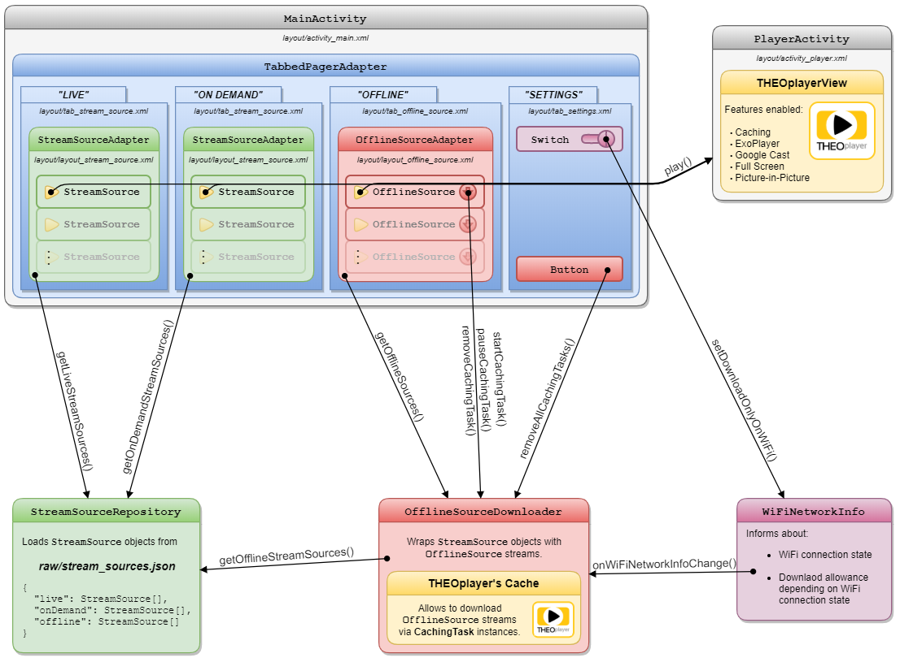

# Reference Apps - THEO Simple OTT

The purpose of this app is to demonstrate how [THEOplayer] could be used in a "real" production-like
application.

For quick start, please proceed with the [Quick Start](#quick-start) guide.  
For application architecture, please proceed with the [Application Architecture](#application-architecture) guide.


## THEO Docs

This app is an extension of [THEO Basic Playback] application. _**THEO Simple OTT**_ application shows various THEOplayer features used together. 
For help with getting started with THEOplayer or Android Studio feel free to check [THEOplayer documentation]


## Quick Start

### Using THEOplayer distribution from public repository

This project is already set up to use THEOplayer from jitpack.io so you need to check it out and build.
Below is a short explanation about how to include THEOplayer in the project.
For the more comprehensive explanation please refer to [THEOplayer documentation].

To use THEOplayer from jitpack.io, you need to include it in the build.gradle file on the project level:

      allprojects {
          repositories {
              ...
              maven { url 'https://jitpack.io' }
              ...
          }
      }

Then, to use the library, specify the following in the module's level build.gradle file:

      dependencies {
          ...
          // THEOplayer required dependencies.
           implementation 'com.theoplayer.theoplayer-sdk-android:basic-minapi21:4.12.0'
          ...
      }

### Using library downloaded from [THEO Portal]

To use THEOplayer from a library downloaded from THEO Portal, follow these steps:
1. Obtain THEOplayer Android SDK and unzip it.

   Please visit [THEOplayer documentation] to get required THEOplayer Android SDK.

2. Copy **`theoplayer-android-[name]-[version]-minapi21-release.aar`** file from unzipped SDK into
   application **[libs]** folder and rename it to **`theoplayer.aar`**.

   Project is configured to load SDK with such name, for using other name please change
   `implementation ':theoplayer@aar'` dependency in [app-level build.gradle] file accordingly.

3. Open _**THEO Simple OTT**_ application in Android Studio.

   Android Studio should automatically synchronize and rebuild project. If this won't happen please
   select **File > Sync Project with Gradle Files** menu item to do it manually. Please note, that
   in very rare cases it will be required to synchronize project twice.

4. Select **Run > Run 'app'** menu item to run application on a device selected by default.


## Application Architecture

Application presents view of four tabs:

  * **LIVE** - where live streams can be played
  * **ON DEMAND** - where VoD streams can be played
  * **OFFLINE** - where available VoD streams can be downloaded nad played
  * **SETTINGS** - where all downloaded streams can be removed and download preferences can be set



Streams presented on tabs are defined in [stream_sources.json] file stored in application raw
resources. They can be easily updated. Every tab that displays streams has its own section in this
JSON configuration. The stream sources JSON configuration should be structured as follows:

```
{
  "live": StreamSource[],
  "onDemand": StreamSource[],
  "offline": StreamSource[]
}
```

where `StreamSource` has following structure:

```
{
  "title": "Stream Title",
  "description": "Some Stream Description",
  "image": "@drawable/streamImage",
  "source": "hxxps://some.host.com/some-asset.m3u8"
}
```

Please note that `image` should keep reference to existing drawable resource.


## Streams/Content Rights:

The DRM streams used in this app (if any) are provided by our Partner: [EZ DRM] and hold all
the rights for the content. These streams are DRM protected and cannot be used for any other purposes.


## License

This project is licensed under the BSD 3 Clause License - see the [LICENSE] file for details.


[//]: # (Links and Guides reference)
[THEOplayer]: https://www.theoplayer.com/
[THEOplayer documentation]: https://docs.theoplayer.com/getting-started/01-sdks/02-android/00-getting-started.md#getting-started-on-android
[THEO Basic Playback]: ../Basic-Playback
[Get Started with THEOplayer]: https://www.theoplayer.com/licensing
[EZ DRM]: https://ezdrm.com/

[//]: # (Project files reference)
[LICENSE]: LICENSE
[libs]: app/libs
[app-level build.gradle]: app/build.gradle
[stream_sources.json]: app/src/main/res/raw/stream_sources.json
